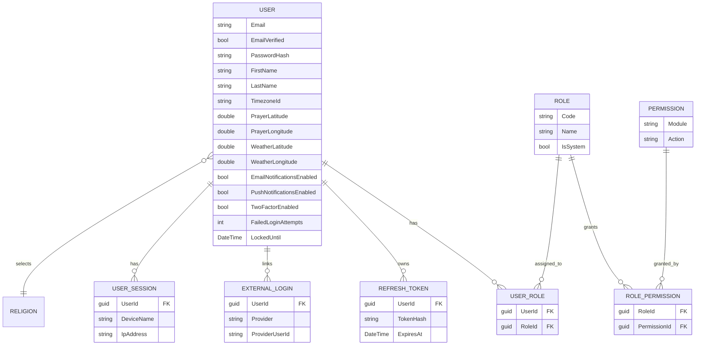
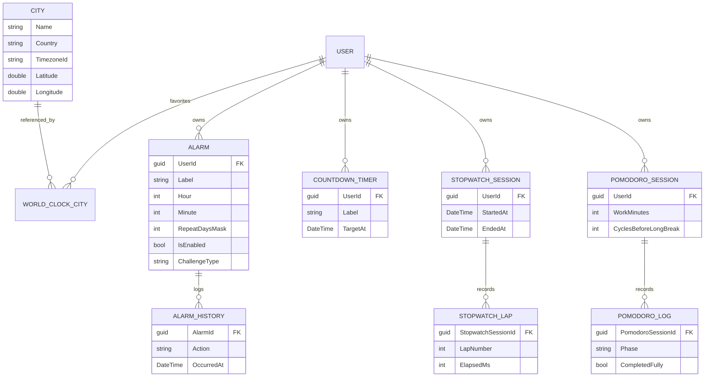
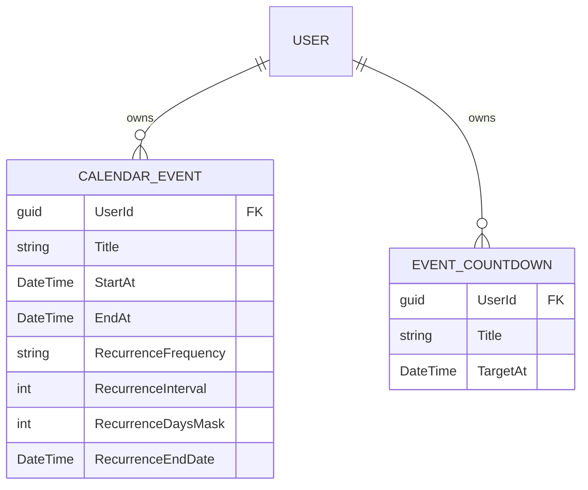
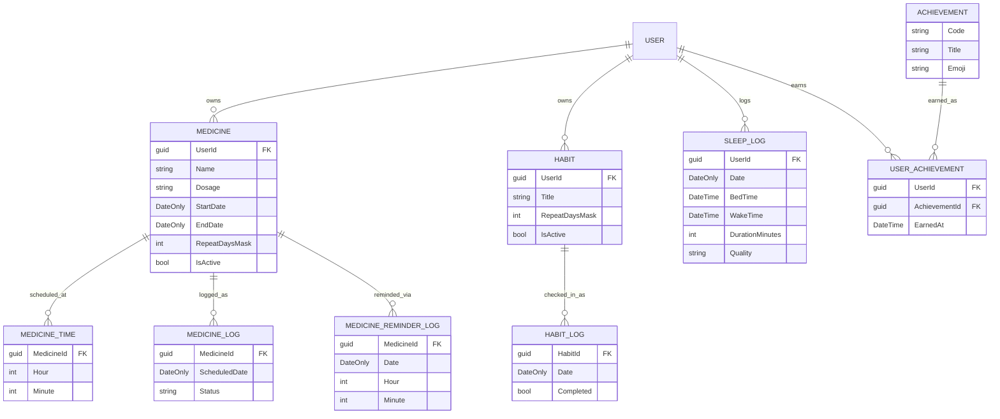
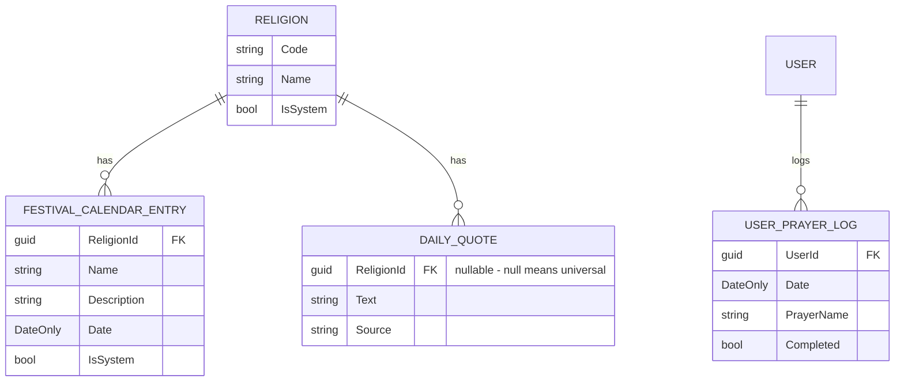
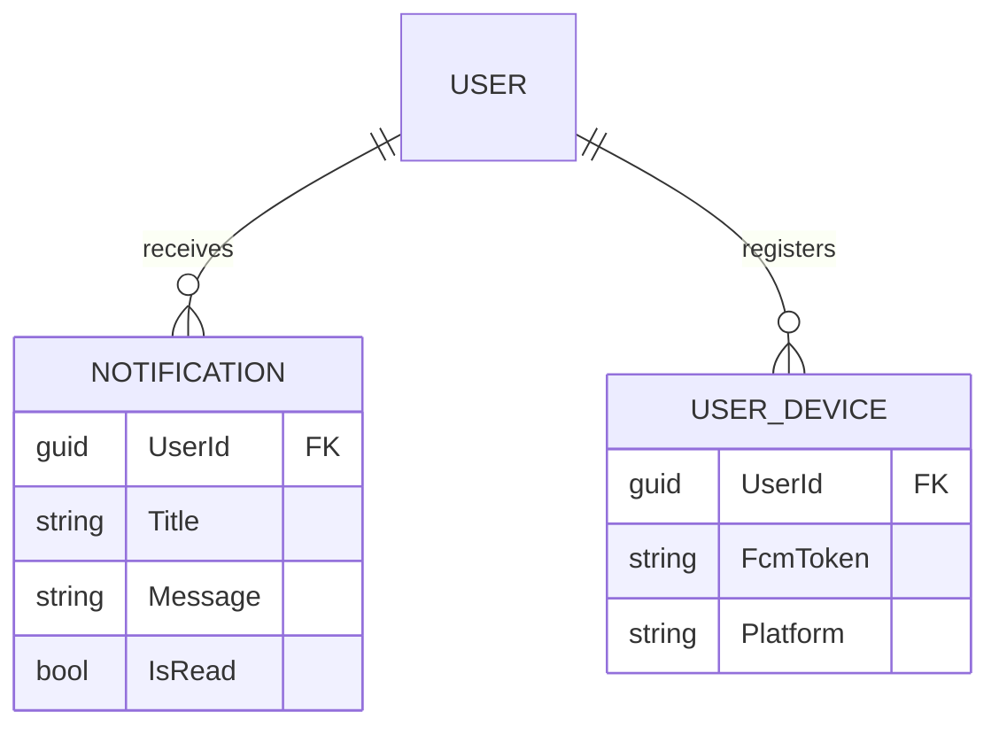
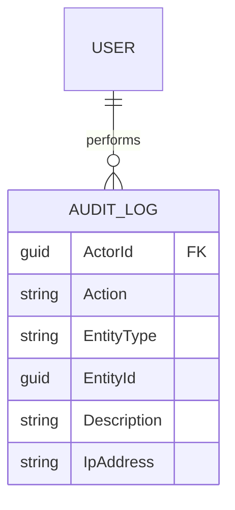

# Entity Relationship Diagram

39 entities across 24 files (several files hold a parent + its child log/detail entity together,
by convention - see [ARCHITECTURE.md](ARCHITECTURE.md)). Split into logical groups below for
readability rather than one unreadable 39-entity diagram; every entity also has `Id` (Guid),
`CreatedAt`, `ModifiedAt`, and `IsDeleted` from the shared `AuditableEntity`/`BaseEntity` base
classes (omitted from each table below to avoid repeating them 39 times).

## Identity & RBAC

## World Clock, Alarms, Timers

## Calendar

## Health & Habits

## Religion & Prayer Center

## Notifications & Devices

## Admin / Audit

Note: `AuditLog` extends `BaseEntity` (not `AuditableEntity`) - it has its own explicit `CreatedAt`
but no `ModifiedAt`/`IsDeleted`, since an audit trail is append-only by design.
